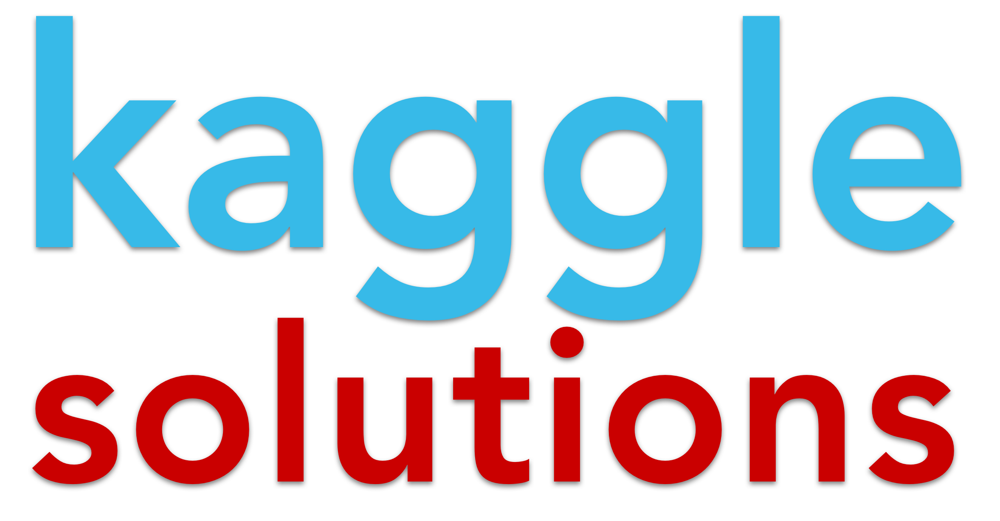

<div align="center">




# kaggle Stable Diffusion - Image to Prompts

</div>

## How it works?

It's very simple: here are the solutions for the [Stable Diffusion - Image to Prompts](https://www.kaggle.com/competitions/stable-diffusion-image-to-prompts/overview)

## Order of preparation and work

1. Clone the repository or download the archive from github or using the following commands on the command line
    ```command line
    $cmd
    $ git clone https://github.com/BEPb/Kaggle_Stable_Diffusion_Image_to_Prompts
    $ cd Kaggle_Stable_Diffusion_Image_to_Prompts
    ```

2. Create a Python virtual environment.
3. Install all necessary packages for our code to work using the following command:

     ```
     pip install -r requirements.txt
     ```

### Stable Diffusion - Image to Prompts


<p style="font-family: consolas; font-size: 16px;">⚪ If you want, you can experiment with this tool on the Hugging Face Space -- *<a href="https://huggingface.co/spaces/pharma/CLIP-Interrogator"><strong>Click</strong></a>*. Example of an output:</p>

